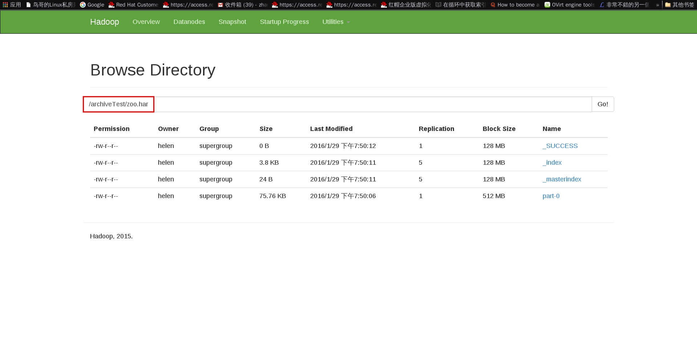

# Hadoop 命令指南

## 概述

### 通用选项

# Hadoop 命令说明

## 用户命令

### archive

* 介绍
  Hadoop archive 是一种特殊的，一个 Hadoop archive 映射了一个文件系统目录，且 Hadoop archive 的名称必须以 `.har` 作为它的扩展名。Hadoop archive 目录中包含了元数据文件（`_index` 和 `_masterindex`）和数据文件（`part-*`）。

* 创建 Archive
  * Usage: hadoop archive -archiveName name -p <parent> [-r <replication factor>] <src>* <dest>
    * name：你创建的 archive 的名称，该名称必须以 `.har` 为后缀名。
    * parent：即将被归档的文件的上一级目录的绝对路径。
    * src：即将被归档的文件相对于 parent 的相对路径，`*` 代表任意个 src。
    * dest：是个目录，归档文件被保存到该目录下。
    * replication factor：默认值是 10，详解：[http://docs.splunk.com/Documentation/Splunk/6.2.0/Indexer/Thereplicationfactor](http://docs.splunk.com/Documentation/Splunk/6.2.0/Indexer/Thereplicationfactor)

  * 举例：
    ~~~ bash
    [helen@yingyun hadoop-2.7.1]$ bin/hadoop archive -archiveName zoo.har -p /user/qiqi -r 5 /archiveTest
    16/01/29 19:49:54 INFO client.RMProxy: Connecting to ResourceManager at /0.0.0.0:8032
    16/01/29 19:49:56 INFO client.RMProxy: Connecting to ResourceManager at /0.0.0.0:8032
    16/01/29 19:49:56 INFO client.RMProxy: Connecting to ResourceManager at /0.0.0.0:8032
    16/01/29 19:49:57 INFO mapreduce.JobSubmitter: number of splits:1
    16/01/29 19:49:58 INFO mapreduce.JobSubmitter: Submitting tokens for job: job_1453454924796_0014
    16/01/29 19:49:58 INFO impl.YarnClientImpl: Submitted application application_1453454924796_0014
    16/01/29 19:49:58 INFO mapreduce.Job: The url to track the job: http://localhost:8088/proxy/application_1453454924796_0014/
    16/01/29 19:49:58 INFO mapreduce.Job: Running job: job_1453454924796_0014
    16/01/29 19:50:03 INFO mapreduce.Job: Job job_1453454924796_0014 running in uber mode : false
    16/01/29 19:50:03 INFO mapreduce.Job:  map 0% reduce 0%
    16/01/29 19:50:08 INFO mapreduce.Job:  map 100% reduce 0%
    16/01/29 19:50:13 INFO mapreduce.Job:  map 100% reduce 100%
    16/01/29 19:50:15 INFO mapreduce.Job: Job job_1453454924796_0014 completed successfully
    16/01/29 19:50:15 INFO mapreduce.Job: Counters: 49
       File System Counters
          FILE: Number of bytes read=4142
          FILE: Number of bytes written=241807
          FILE: Number of read operations=0
          FILE: Number of large read operations=0
          FILE: Number of write operations=0
          HDFS: Number of bytes read=80814
          HDFS: Number of bytes written=81498
          HDFS: Number of read operations=87
          HDFS: Number of large read operations=0
          HDFS: Number of write operations=7
       Job Counters 
          Launched map tasks=1
          Launched reduce tasks=1
          Other local map tasks=1
          Total time spent by all maps in occupied slots (ms)=2681
          Total time spent by all reduces in occupied slots (ms)=3014
          Total time spent by all map tasks (ms)=2681
          Total time spent by all reduce tasks (ms)=3014
          Total vcore-seconds taken by all map tasks=2681
          Total vcore-seconds taken by all reduce tasks=3014
          Total megabyte-seconds taken by all map tasks=2745344
          Total megabyte-seconds taken by all reduce tasks=3086336
       Map-Reduce Framework
          Map input records=40
          Map output records=40
          Map output bytes=4054
          Map output materialized bytes=4142
          Input split bytes=117
          Combine input records=0
          Combine output records=0
          Reduce input groups=40
          Reduce shuffle bytes=4142
          Reduce input records=40
          Reduce output records=0
          Spilled Records=80
          Shuffled Maps =1
          Failed Shuffles=0
          Merged Map outputs=1
          GC time elapsed (ms)=54
          CPU time spent (ms)=1540
          Physical memory (bytes) snapshot=440868864
          Virtual memory (bytes) snapshot=2083385344
          Total committed heap usage (bytes)=377487360
       Shuffle Errors
          BAD_ID=0
          CONNECTION=0
          IO_ERROR=0
          WRONG_LENGTH=0
          WRONG_MAP=0
          WRONG_REDUCE=0
       File Input Format Counters 
          Bytes Read=3115
       File Output Format Counters 
          Bytes Written=0
    ~~~
    
    
  * 一些重点&疑问：
    1. Note that this is a Map/Reduce job that creates the archives. You would need a map reduce cluster to run this. 
    
    
### checknative

### classpath

### credential

### distcp

### fs

### jar

### key

### trace

### version

### CLASSNAME

## 管理员命令

### daemonlog

