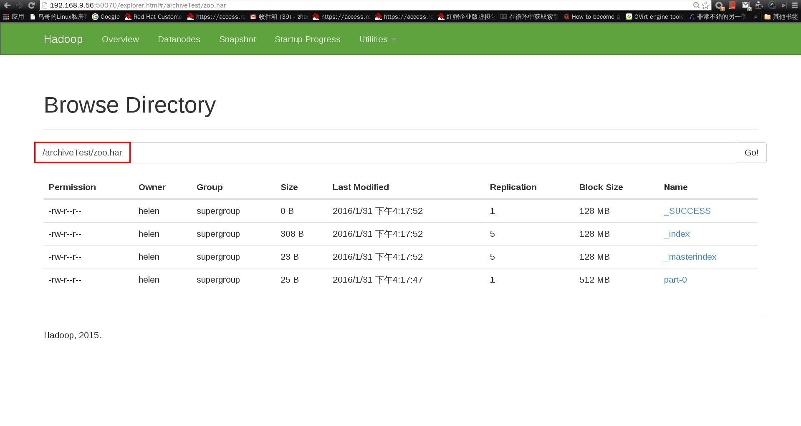

# Hadoop 命令指南

## 概述

### 通用选项

# Hadoop 命令说明

## 用户命令

### archive

* 介绍
  Hadoop archive 是一种特殊的，一个 Hadoop archive 映射了一个文件系统目录，且 Hadoop archive 的名称必须以 `.har` 作为它的扩展名。Hadoop archive 目录中包含了元数据文件（`_index` 和 `_masterindex`）和数据文件（`part-*`）。

* 创建 Archive
  * Usage: hadoop archive -archiveName name -p <parent> [-r <replication factor>] <src>* <dest>
    * name：你创建的 archive 的名称，该名称必须以 `.har` 为后缀名。
    * parent：即将被归档的文件的上一级目录的绝对路径。
    * src：即将被归档的文件相对于 parent 的相对路径，`*` 代表任意个 src。
    * dest：是个目录，归档文件被保存到该目录下。
    * replication factor：默认值是 10，详解：[http://docs.splunk.com/Documentation/Splunk/6.2.0/Indexer/Thereplicationfactor](http://docs.splunk.com/Documentation/Splunk/6.2.0/Indexer/Thereplicationfactor)

  * 举例：
    * 前期准备：
      ~~~ bash
      [helen@yingyun hadoop-2.7.1]$ echo Hello World >> file0
      [helen@yingyun hadoop-2.7.1]$ echo Hello Hadoop >> file00
      [helen@yingyun hadoop-2.7.1]$ bin/hdfs dfs -mkdir -p /user/qiqi/dir0 /user/qiqi/dir1
      [helen@yingyun hadoop-2.7.1]$ bin/hdfs dfs -touchz /user/qiqi/file2
      [helen@yingyun hadoop-2.7.1]$ bin/hdfs dfs -put file0 /user/qiqi/file0
      [helen@yingyun hadoop-2.7.1]$ bin/hdfs dfs -put file00 /user/qiqi/dir0/file00

    * 创建 hadoop archive      
      ~~~ bash
      [helen@yingyun hadoop-2.7.1]$ bin/hadoop archive -archiveName zoo.har -p /user/qiqi -r 5 /archiveTest
      16/01/31 16:17:36 INFO client.RMProxy: Connecting to ResourceManager at /0.0.0.0:8032
      16/01/31 16:17:37 INFO client.RMProxy: Connecting to ResourceManager at /0.0.0.0:8032
      16/01/31 16:17:37 INFO client.RMProxy: Connecting to ResourceManager at /0.0.0.0:8032
      16/01/31 16:17:38 INFO mapreduce.JobSubmitter: number of splits:1
      16/01/31 16:17:38 INFO mapreduce.JobSubmitter: Submitting tokens for job: job_1453454924796_0015
      16/01/31 16:17:38 INFO impl.YarnClientImpl: Submitted application application_1453454924796_0015
      16/01/31 16:17:38 INFO mapreduce.Job: The url to track the job: http://localhost:8088/proxy/application_1453454924796_0015/
      16/01/31 16:17:38 INFO mapreduce.Job: Running job: job_1453454924796_0015
      16/01/31 16:17:43 INFO mapreduce.Job: Job job_1453454924796_0015 running in uber mode : false
      16/01/31 16:17:43 INFO mapreduce.Job:  map 0% reduce 0%
      16/01/31 16:17:48 INFO mapreduce.Job:  map 100% reduce 0%
      16/01/31 16:17:54 INFO mapreduce.Job:  map 100% reduce 100%
      16/01/31 16:17:55 INFO mapreduce.Job: Job job_1453454924796_0015 completed successfully
      16/01/31 16:17:55 INFO mapreduce.Job: Counters: 49
         File System Counters
            FILE: Number of bytes read=344
            FILE: Number of bytes written=234203
            FILE: Number of read operations=0
            FILE: Number of large read operations=0
            FILE: Number of write operations=0
            HDFS: Number of bytes read=524
            HDFS: Number of bytes written=356
            HDFS: Number of read operations=19
            HDFS: Number of large read operations=0
            HDFS: Number of write operations=7
         Job Counters 
            Launched map tasks=1
            Launched reduce tasks=1
            Other local map tasks=1
            Total time spent by all maps in occupied slots (ms)=2725
            Total time spent by all reduces in occupied slots (ms)=3120
            Total time spent by all map tasks (ms)=2725
            Total time spent by all reduce tasks (ms)=3120
            Total vcore-seconds taken by all map tasks=2725
            Total vcore-seconds taken by all reduce tasks=3120
            Total megabyte-seconds taken by all map tasks=2790400
            Total megabyte-seconds taken by all reduce tasks=3194880
         Map-Reduce Framework
            Map input records=5
            Map output records=5
            Map output bytes=328
            Map output materialized bytes=344
            Input split bytes=117
            Combine input records=0
            Combine output records=0
            Reduce input groups=5
            Reduce shuffle bytes=344
            Reduce input records=5
            Reduce output records=0
            Spilled Records=10
            Shuffled Maps =1
            Failed Shuffles=0
            Merged Map outputs=1
            GC time elapsed (ms)=58
            CPU time spent (ms)=1410
            Physical memory (bytes) snapshot=429936640
            Virtual memory (bytes) snapshot=2079178752
            Total committed heap usage (bytes)=377487360
         Shuffle Errors
            BAD_ID=0
            CONNECTION=0
            IO_ERROR=0
            WRONG_LENGTH=0
            WRONG_MAP=0
            WRONG_REDUCE=0
         File Input Format Counters 
            Bytes Read=382
         File Output Format Counters 
            Bytes Written=0
      ~~~
    
    * 浏览 NameNode 网页
      
   
    * 将分布式文件系统中的 `/archiveTest/zoo.har` 目录拷贝到本机的文件系统中，便于查看目录中的内容
      ~~~ bash
      [helen@yingyun hadoop-2.7.1]$ bin/hdfs dfs -get /archiveTest/zoo.har ./tmp
      16/01/31 16:23:02 WARN hdfs.DFSClient: DFSInputStream has been closed already
      16/01/31 16:23:02 WARN hdfs.DFSClient: DFSInputStream has been closed already
      16/01/31 16:23:02 WARN hdfs.DFSClient: DFSInputStream has been closed already
      16/01/31 16:23:02 WARN hdfs.DFSClient: DFSInputStream has been closed already
      [helen@yingyun hadoop-2.7.1]$ cat tmp/*
      %2F dir 1454225682848+493+helen+supergroup 0 0 dir0 dir1 file0 
      %2Fdir0 dir 1454227957903+493+helen+supergroup 0 0 file00 
      %2Fdir1 dir 1454211134238+493+helen+supergroup 0 0 
      %2Fdir0%2Ffile00 file part-0 0 13 1454227957863+420+helen+supergroup 
      %2Ffile0 file part-0 13 12 1454222710628+420+helen+supergroup 
      3 
      0 1443004261 0 308 
      Hello Hadoop
      Hello World
      ~~~

  * 一些重点&疑问：
    1. Note that this is a Map/Reduce job that creates the archives. You would need a map reduce cluster to run this. 
    2. 
    
    
### checknative

### classpath

### credential

### distcp

### fs

### jar

### key

### trace

### version

### CLASSNAME

## 管理员命令

### daemonlog

